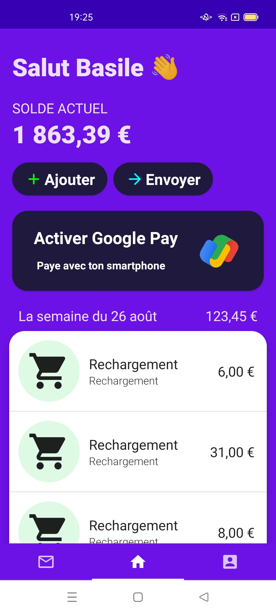
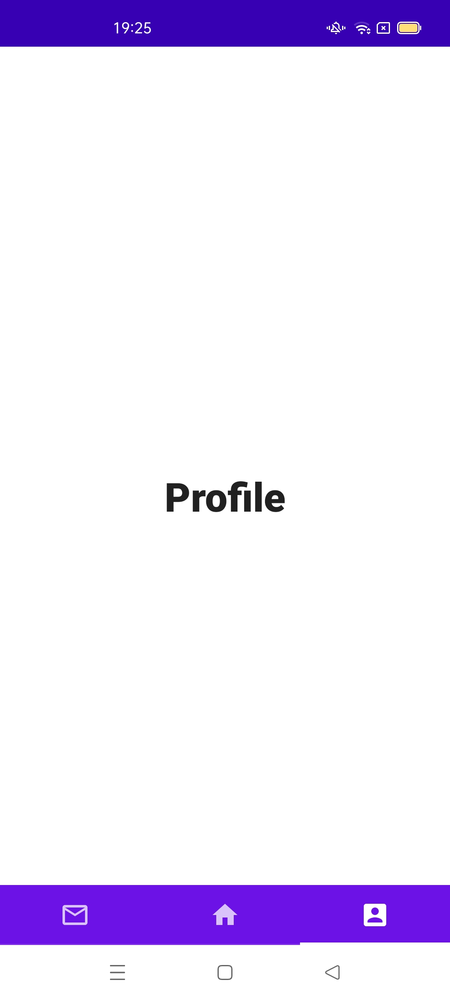
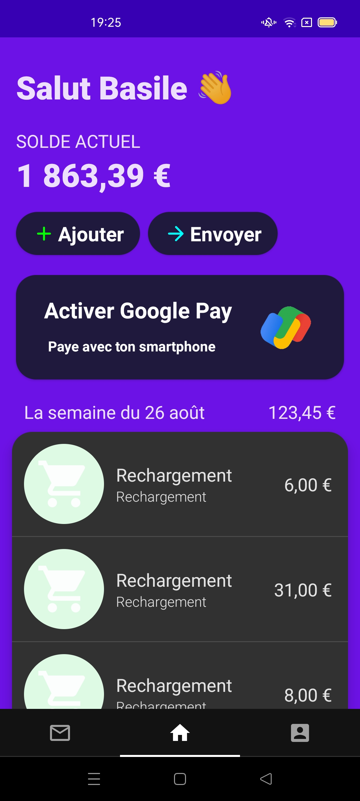
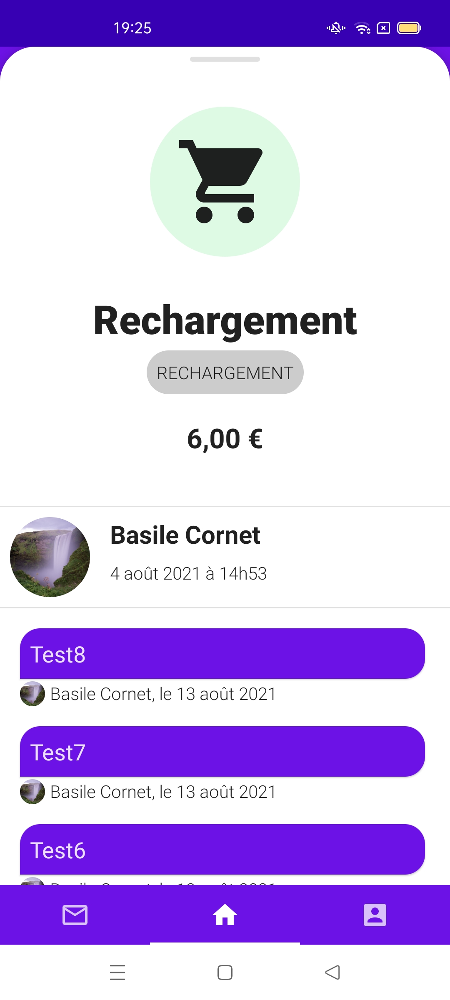
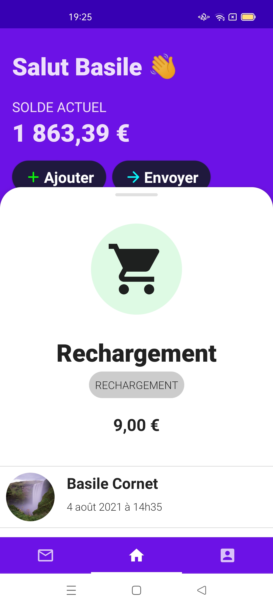
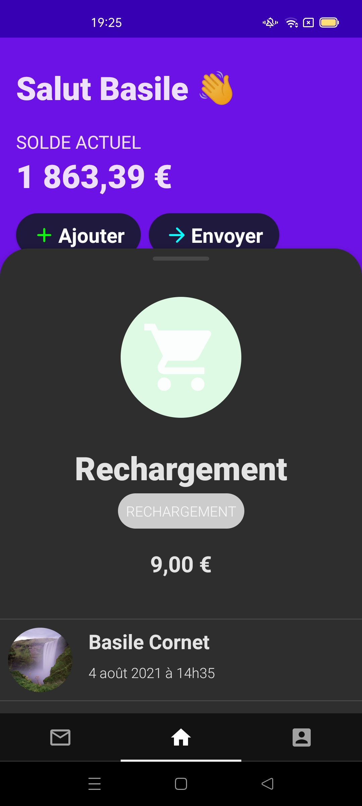
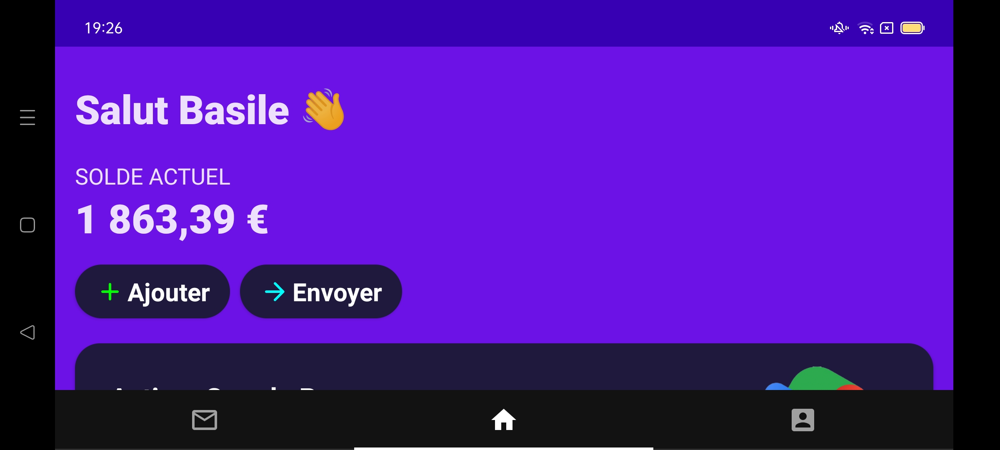
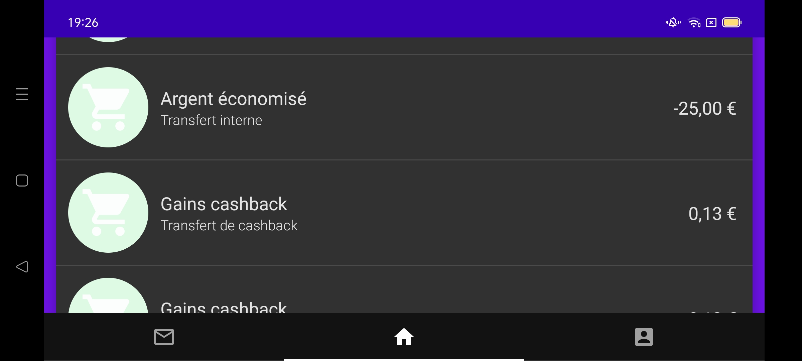

# Mini-Kard

## Technical choices :

- Apollo: Not used to graphql but I know many people use Apollo, a pleasant first experience.
- JetpackCompose: Let's learn new stuff (also no Fragment), could have pushed a bit more on Compose Navigation though.Apollo
- Koin: Started with a manual DI but wanted to try the Compose/ViewModel integration, smooth integration.
- Koil: I use it often, pretty simple and Compose integration is so smooth.
- Only 1 ViewModel as the example is super simple

### To do

Investigate a better approach for the user picture loading to reduce loading time. (Koil provide cache but it doesn't look enough...)
Styling / clean theming
Handle pagination (?)
Handle transaction grouping by week
Unit test / Android test
More advanced hierarchy (split in multiple ViewModel)
Error management (start in plane mode = dummy data)
Transparent menu

